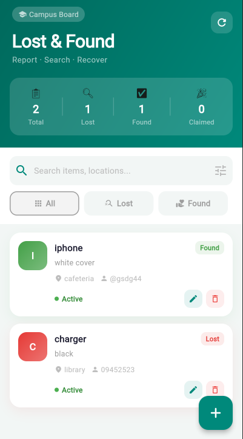
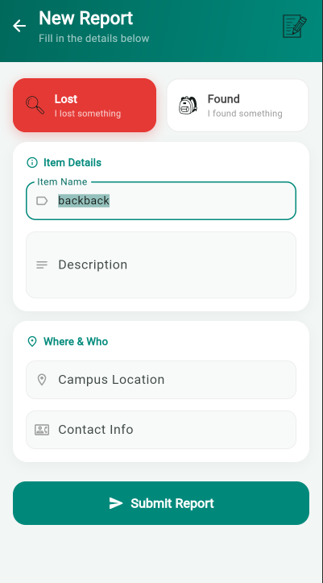
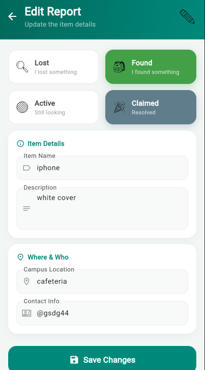
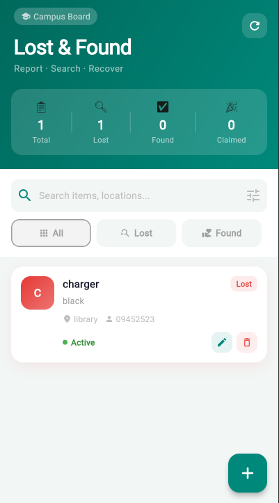

# Campus Lost & Found

Student: Zenebu Melaku
ID:UGR/6058/16
Section: 2

A Flutter application for reporting and tracking lost & found items on campus. Built with Bloc state management and Dio for network requests.

## Features

- View all lost & found reports
- Create new reports
- Edit existing reports
- Delete reports
- Search by title or location
- Filter by All / Lost / Found

## Tech Stack

- **Flutter** — UI framework
- **flutter_bloc** — state management
- **Dio** — HTTP network requests
- **MockAPI** — REST API backend

## Project Structure

```
lib/
├── bloc/
│   ├── item_cubit.dart
│   └── item_state.dart
├── data/
│   ├── models/
│   │   └── item_model.dart
│   └── repositories/
│       └── item_repository.dart
├── presentation/
│   ├── screens/
│   │   ├── home_screen.dart
│   │   └── add_edit_screen.dart
│   └── widgets/
│       └── status_badge.dart
└── main.dart
```

## Screenshots

### Home Screen



### Add New Item



### Edit Item



### After Delete


